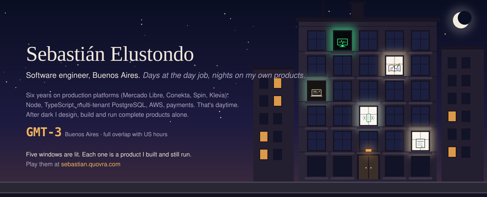
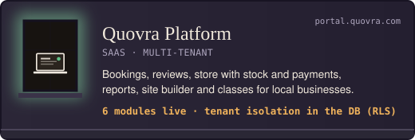
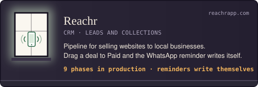
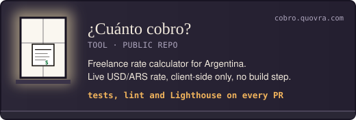
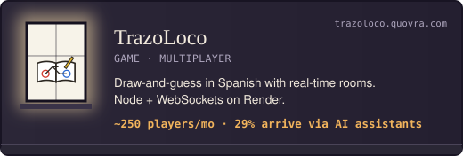
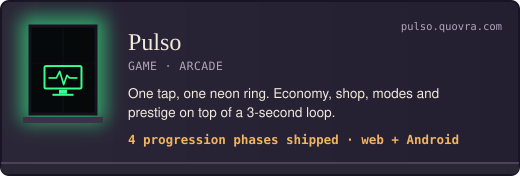
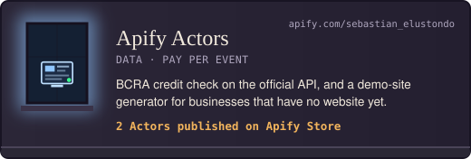
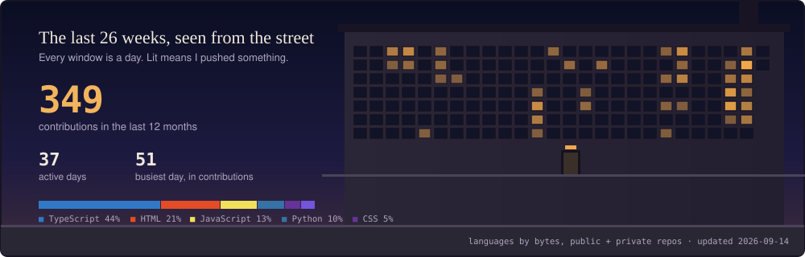

<picture>
  <source media="(prefers-color-scheme: dark)" srcset="assets/banner-dark.svg">
  <source media="(prefers-color-scheme: light)" srcset="assets/banner-light.svg">
  
</picture>

**Senior Software Engineer / Tech Lead. 6+ years building and operating production platforms at Mercado Libre, Conekta, Spin and Kleva. I also ship complete products solo.**

Backend-leaning full-stack: Node.js, TypeScript and PostgreSQL on AWS, with a focus on multi-tenant architectures (Row-Level Security), payment and third-party integrations, and disciplined delivery: API contracts, tests, CI/CD, monitoring, rollbacks. I work with AI-assisted tooling (Claude Code) the way a senior engineer should: 3-5x faster, still accountable for every line.

**[sebastian.quovra.com](https://sebastian.quovra.com)** (playable portfolio + CV) · [CV as PDF](https://sebastian.quovra.com/Sebastian_Elustondo_CV.pdf) · [LinkedIn](https://www.linkedin.com/in/sebastian-elustondo) · sebastianelustondo@gmail.com

### Live

Each card is a window from the building above: a product I designed, built and still run.

<table>
<tr>
<td width="50%"><a href="https://portal.quovra.com"><picture><source media="(prefers-color-scheme: dark)" srcset="assets/card-quovra-dark.svg"><source media="(prefers-color-scheme: light)" srcset="assets/card-quovra-light.svg"></picture></a></td>
<td width="50%"><a href="https://reachrapp.com"><picture><source media="(prefers-color-scheme: dark)" srcset="assets/card-reachr-dark.svg"><source media="(prefers-color-scheme: light)" srcset="assets/card-reachr-light.svg"></picture></a></td>
</tr>
<tr>
<td width="50%"><a href="https://github.com/SebastianElustondo/cuanto-cobro"><picture><source media="(prefers-color-scheme: dark)" srcset="assets/card-cobro-dark.svg"><source media="(prefers-color-scheme: light)" srcset="assets/card-cobro-light.svg"></picture></a></td>
<td width="50%"><a href="https://trazoloco.quovra.com"><picture><source media="(prefers-color-scheme: dark)" srcset="assets/card-trazoloco-dark.svg"><source media="(prefers-color-scheme: light)" srcset="assets/card-trazoloco-light.svg"></picture></a></td>
</tr>
<tr>
<td width="50%"><a href="https://pulso.quovra.com"><picture><source media="(prefers-color-scheme: dark)" srcset="assets/card-pulso-dark.svg"><source media="(prefers-color-scheme: light)" srcset="assets/card-pulso-light.svg"></picture></a></td>
<td width="50%"><a href="https://apify.com/sebastian_elustondo"><picture><source media="(prefers-color-scheme: dark)" srcset="assets/card-apify-dark.svg"><source media="(prefers-color-scheme: light)" srcset="assets/card-apify-light.svg"></picture></a></td>
</tr>
</table>

Numbers as of 2026-09-14, kept by hand in <code>assets/projects.json</code>. Studio work (client sites, the Quovra platform) lives at <a href="https://quovra.com">quovra.com</a>.

### Seen from the street

<picture>
  <source media="(prefers-color-scheme: dark)" srcset="assets/stats-dark.svg">
  <source media="(prefers-color-scheme: light)" srcset="assets/stats-light.svg">
  
</picture>

Most of my code is in private repos (client work and products); the card counts it anyway. Redrawn weekly by <code>scripts/stats.py</code>, no third-party stats service involved.

### Stack

| | |
|---|---|
| **Backend** | Node.js · TypeScript · Go · REST APIs and API contract design · OAuth, webhooks, payment integrations |
| **Data** | PostgreSQL (schema design, migrations, Row-Level Security, multi-tenant) · Redis · Kafka · RabbitMQ |
| **Cloud** | AWS: Lambda, API Gateway, SQS, S3, RDS, ECS, EC2, IAM, VPC, CloudWatch, Secrets Manager · Cloudflare: Workers, Pages, R2, D1 · Supabase · GCP |
| **Frontend** | React · Next.js · Angular · Astro · Phaser |
| **Quality & delivery** | Jest (unit, integration, E2E, mocks) · GitHub Actions · Jenkins · controlled releases and rollbacks |
| **Observability** | CloudWatch · Grafana · Datadog |
| **Also** | Python · .NET · Ruby |

### Now

- Open to **remote full-time roles** (Argentina, GMT-3, full overlap with US hours).
- **Fixing and finishing vibe-coded apps** (Lovable / Replit / Bolt) for a flat fee: deploy, auth, database, security. DMs open.

This repo is also the source of sebastian.quovra.com; see <a href="DOCS.md">DOCS.md</a>. The banner, cards and stats above are generated by the stdlib-only scripts in <code>scripts/</code>.
